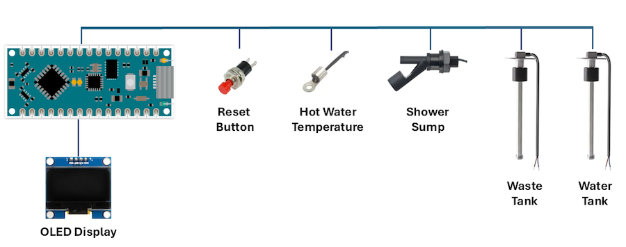

# Marine Water Meter

## Project Overview
A project to replace the existing analog water gauge on a Sealine S28 with a digital version based on Arduino.

The domestic fresh water gauge on the boat is not the most accurate, nor is it very user-friendly. This project improves upon it by incorporating a digital display with additional measurements such as:
- Water temperature
- Waste tank level
- Shower Sump monitoring

An OLED display fits where the existing analog meter is installed, and an Arduino is mounted behind the electrical panel.

## Features
- **Power-up sequence:**
  - Checks supply voltage
  - Verifies shower sump status
  - Displays waste tank level for 5 seconds
  - Shows fresh water tank level and domestic hot water temperature
- **Tank level updates every 5 seconds** to prevent value from fluctuating quickly due to boat movement
- **Power-saving mode:**
  - Board sleeps after a defined timeout to save power
  - Reduces light distraction at night
- **Temperature monitoring:**
  - Thermistor attached to the hot water cylinder surface relays temperature
  - Temperature monitoring for another device, eg Fridge.

## Power Consumption
- **Active mode:** 81mA
- **Sleep mode:** 16mA
- **Power input:** 9 - 32V DC (depends on regulator installed) Typically 12-14v would be the normal voltage on the boat.

## Sensors & Functionality
### Waste & Water Tank
- Uses a **0-190 Ohm water level sensor** of appropriate length for the tank.
- Code calculates tank level based on resistance and displays a percentage value.

### Water Temperature
- Thermistor adhered to the hot water cylinder surface calculates the temperature.

### Shower Sump Monitoring
- Shower sump boxes can fail, leading to overflow into the bilge, a **magnetic float switch** is added to the sump case
- At power up the system checks the switch and displays:
  - `Shower Sump FULL`  
**OR**
  - `Shower Sump OK`
- Whilst running a timer periodically checks the switch and if the shower sump is full (switch closed) the display will show:
  - `Shower Sump FULL`
  - Option to control a LED which could show a warning on a panel.

## User Interaction
- The board is powered from the existing domestic water pump circuit. The existing push switch on the panel used to read the old analogue display is repurposed to wake the board when pressed. This perfoms a reset on the Arduino.
- Upon wake-up, all readings are displayed before switching to fresh tank level and hot water temperature.

## Additional Considerations
- The project uses 2x **0-190 Ohm water level gauge sensor**
- Installation requires drilling into the black tank and water tank and running twin core cable from the tanks to the Arduino.

## Future Ideas
- Rotary encoder is supported on the PCB,  need to create code for the board to select other functions as required.
- Air quality monitor based on BME688 has been added to the hardware design. Needs to be coded. Can be used to monitor Temperature, Humidity, Pressure and Gas.
- Recently added additional hardware support for a 2nd temperature input. Could be used to monitor fridge temperature.
- With this configuration the Arduino has 3 spare digital inputs and 1 analogue input for future expansion.
  

## Video Showing Operation (Earlier version)
  https://www.youtube.com/shorts/WlagKgHyAQc

## Boards Available
I do have a limited number of blank PCBs available based on the latest design for £6.00 (UK post only).
[PCB](./pcb/PCB_Layout.png)

